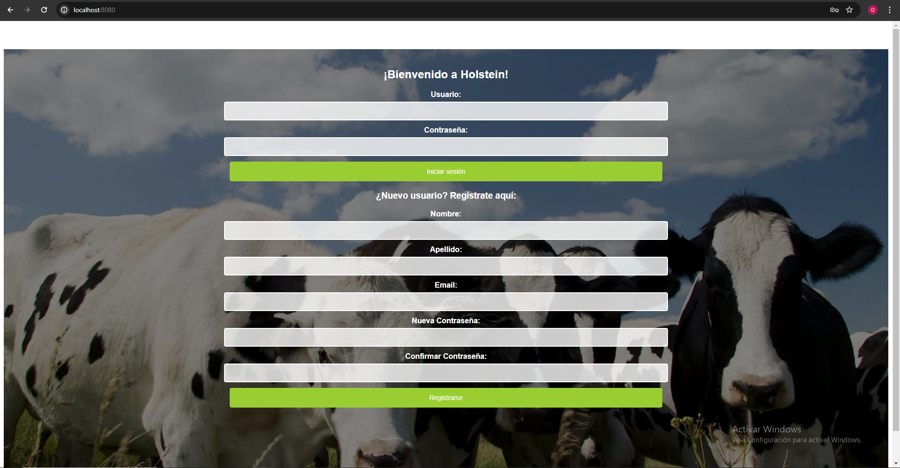
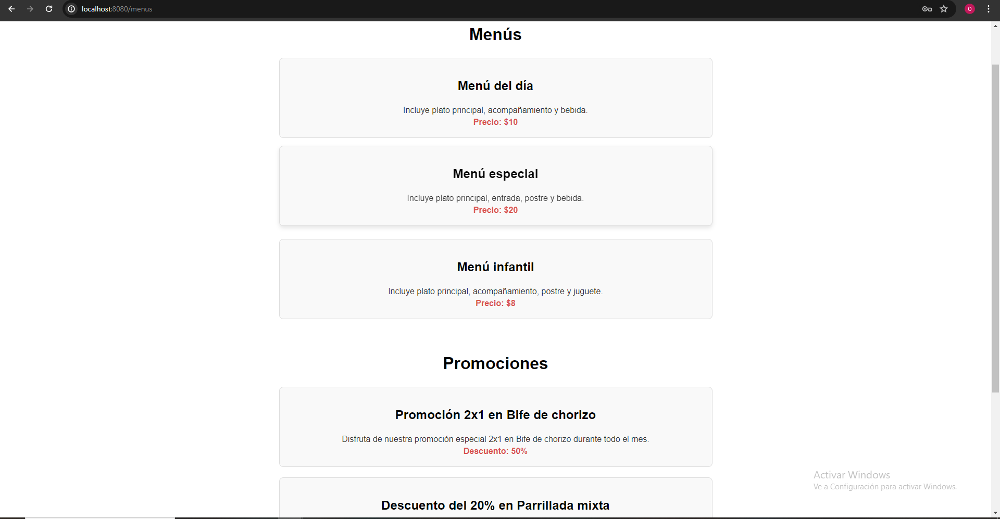
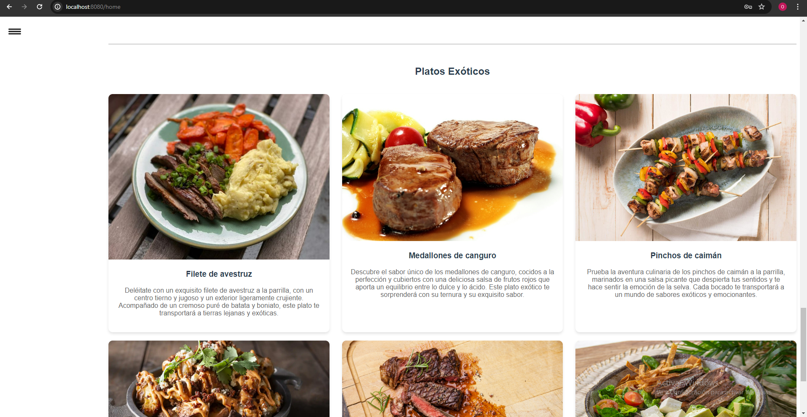

# M04 Lenguaje de Marcas 

## Proyecto Holstein: Desarrollo de la Interfaz de Usuario

En este apartado, se ha desarrollado la interfaz de usuario para el proyecto del restaurante Holstein, especializado en carnes. Hemos utilizado Vue.js para crear una aplicación web dinámica y funcional que permite a los usuarios interactuar con el sistema de manera intuitiva y eficiente. A continuación, se detallan las tareas realizadas durante el desarrollo:

### Configuración Inicial de Vue

El primer paso fue la configuración inicial de Vue.js, un framework progresivo de JavaScript que facilita la creación de interfaces de usuario interactivas. Se creó un proyecto Vue desde cero, configurando el entorno de desarrollo para soportar las necesidades del proyecto Holstein.


##  1. Descargar Node.js

[Web de Node.js](https://nodejs.org/en)


##  2. Instalar Vue Cli

Con el siguiente comando: 

```bash
# Comando para instalar Vue Cli
npm install -g @vue/cli

```
##  3. Crear proyecto Vue

En el terminal de Visual Studio Code ejecutamos el siguiente comando y configuramos a nuestro gusto: 

```bash
# Comando para crear un nuevo proyecto Vue
vue create holstein-app

```

##  4. Instalar Vue Router

En la terminal de Visual Studio Code navegamos hasta nuestro proyecto e instalamos Vue Router

```bash
# Comando para instalar Vue Router
npm install vue-router

```

##  5. Crear componentes Vue y configuración de Vue Router

WORK IN PROGRESS
(añadir imagenes codigo y explicación)

##   6. Ejecutar la aplicación


```bash
# Comando para instalar Vue Router
npm run serve

```

## 7. Resultado

Despúes de configurar y editar a nuestro gusto este proyecto, nuestra página con Vue se ve así:

Página de Inicio



Menús:



Platos:



